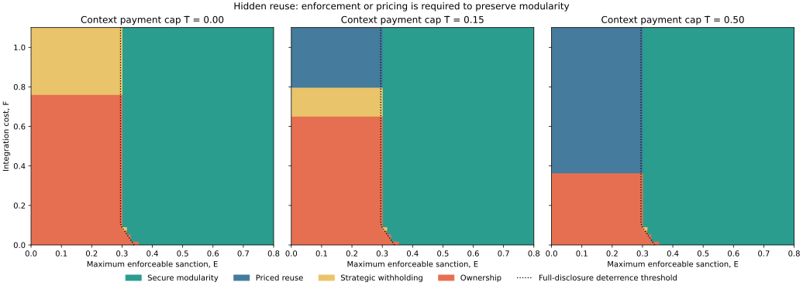
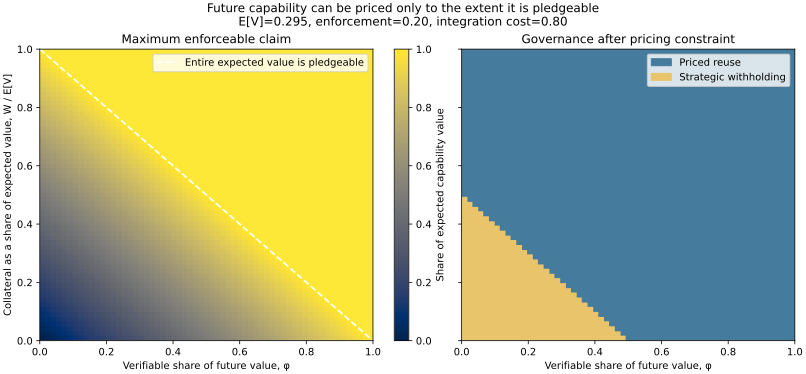
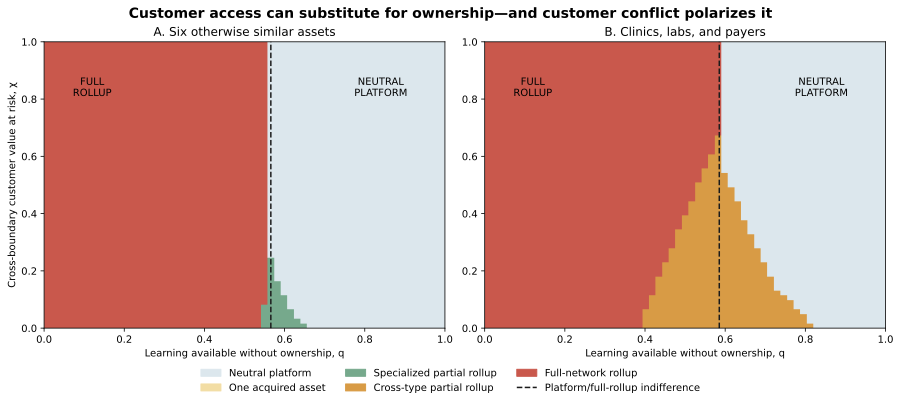
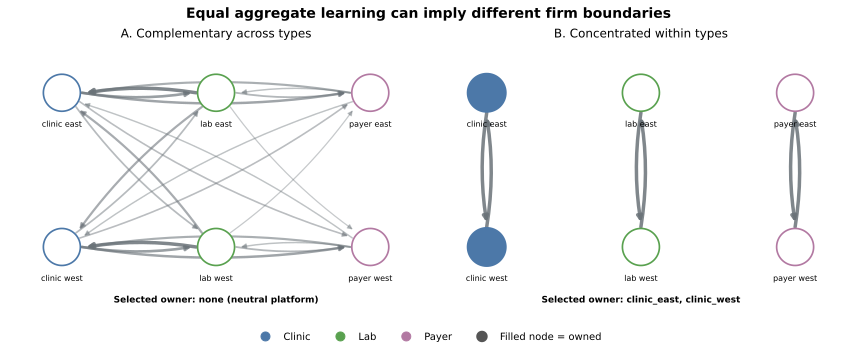
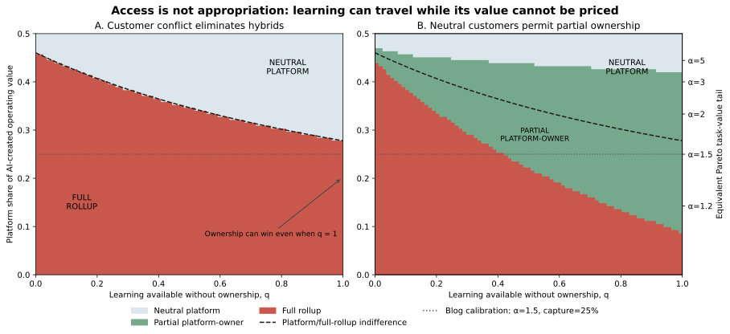

# Figure guide

## Figure 1



### Publication caption

**Figure 1. Governance under hidden reuse.** Each cell reports the
period-one equilibrium of the calibrated two-period game. The horizontal axis
is maximum enforcement capacity \(E\): the expected sanction per reused context
unit under full monitoring. The vertical axis is integration cost \(F\). Panels
increase the maximum provider payment for permission to retain and benefit from
what it learns, \(\bar T\), from zero to 0.50. The dotted curve is
\(E_D(1;F)=G(1;F)\), the enforcement capacity required to make non-reuse
feasible at full disclosure. It is a feasibility boundary, not a sufficient
condition for secure modularity. Strong enforcement supports secure modularity;
weak enforcement and low integration cost produce ownership; weak enforcement
and constrained payments produce strategic withholding; and greater payment
capacity permits full disclosure with priced reuse. All other parameters use
the illustrative baseline in `MODEL.md`. Results are theoretical computations,
not empirical estimates.

### Short caption

When hidden provider learning cannot be deterred, the ability to pay the owner
for reuse determines whether full exchange between independent firms survives;
otherwise the context owner withholds or integrates.

### Alt text

Three side-by-side phase diagrams plot maximum enforceable sanctions from zero
to 0.8 horizontally and integration cost from zero to 1.1 vertically. The left,
middle, and right panels allow provider payments for context of zero, 0.15, and
0.50 per disclosed unit. Four colored regions identify secure modularity,
priced reuse, strategic withholding, and ownership. Secure modularity fills
most of the region to the right of a dotted deterrence threshold near 0.30.
With weak enforcement on the left, ownership is concentrated at low
integration costs. At higher integration costs, the zero-payment panel contains
strategic withholding. As payment capacity rises across panels, priced reuse
replaces much of the withholding and some ownership. The dotted threshold bends
slightly at very low integration costs because integration changes what each
party can earn if renewal fails.

## Figure 2



### Publication caption

**Figure 2. Pricing uncertain future capability.** Let \(\mu=\mathbb E[V]\)
be the provider's expected net value from the capability created by reuse,
\(\phi\) the largest share of realized value a contract can verify and collect,
and \(W\) collateral secured before realization. The left panel reports the
maximum pledgeable share \(\min\{1,W/\mu+\phi\}\). The dashed diagonal marks
combinations where all expected value is pledgeable. Below it, even competition
cannot make the unverifiable, unsecured remainder collectible. The right panel
substitutes \(P^*\) for the hidden-reuse model's payment cap at weak
enforcement \(E=0.20\), costly integration \(F=0.80\), and baseline
\(\mu=0.295\). Low pledgeability produces strategic withholding. Sufficient
verifiability or collateral supports full disclosure with priced reuse. The
calibration is illustrative and the cells are theoretical computations, not
empirical estimates.

### Short caption

Unknown capability can be priced in expectation, but only verifiable future
value and secured collateral can be promised to the context owner.

### Alt text

Two side-by-side square panels use verifiable future-value share from zero to
one on the horizontal axis and collateral divided by expected capability value
from zero to one on the vertical axis. In the left heat map, the pledgeable
fraction rises diagonally from zero at the lower-left corner to one above a
dashed line running from the upper-left to lower-right. In the right regime
map, a triangular strategic-withholding region occupies the lower-left corner,
where little value is verifiable or collateralized. The remainder is priced
reuse. The displayed scenario holds enforcement at 0.20, integration cost at
0.80, and expected net capability value at 0.295.

## Figure 3


### Publication caption

**Figure 3. Integration entry and conditional firm size.** A firm owning
\(n\) homogeneous context-generating assets creates per-asset incremental
surplus
\(g(n)=A-K/n+L(n-1)/(\kappa+n-1)-dn^{\rho-1}-cn^\eta\). Cumulative
integration-execution cost \(dn^\rho\) has declining marginal cost for
\(0<\rho<1\), while ongoing coordination cost \(cn^{1+\eta}\) rises
convexly. The left panel varies the
per-asset internalization advantage \(A\) and transferable cross-asset learning
\(L\). Gray cells remain modular; colored cells form integrated firms, with
color reporting assets per firm. The black curve is the integration-entry
threshold. The two marked points feed strong- and weak-enforcement outcomes
from the bilateral hidden-reuse model into the scale model. Along a fixed row,
changing \(A\) crosses the entry boundary without changing conditional size.
The right panel holds the entry decision aside and varies cross-asset learning
and ongoing coordination-cost scale while fixing the integration learning
curve at \(d=0.50,\rho=0.65\). More transferable learning supports larger
firms; greater ongoing coordination cost supports smaller firms. Parameters
are normalized theoretical inputs, not empirical estimates.

### Short caption

Hidden reuse changes whether assets integrate; transferable learning, shared
fixed costs, integration experience, and ongoing coordination burden determine
how large the integrated firm becomes.

### Alt text

Two side-by-side phase maps separate firm formation from firm size. In the left
panel, internalization advantage runs from 0.30 to 0.90 horizontally and
cross-asset learning from zero to one vertically. A descending black boundary
separates a gray modular region at the lower left from colored integrated-firm
regions at the upper right. At baseline learning of 0.35, a white point labeled
strong enforcement lies in the modular region and a black point labeled weak
enforcement lies in an eight-asset region. Within each horizontal learning band,
raising internalization advantage changes modular entry but not the integrated
firm's color. In the right panel, ongoing coordination-cost scale rises
horizontally and cross-asset learning rises vertically. The
declining-marginal-cost integration curve is held fixed. Firm size is largest
at high learning and low ongoing coordination cost, and declines toward the
lower-right. A black point marks the eight-asset baseline.

## Figure 4



### Publication caption

**Figure 4. Customer access can substitute for ownership, while customer
conflict polarizes governance.** The horizontal axis is external learning
efficiency \(q\): the share of directed cross-node learning the intermediary
can realize while operating assets remain independent customers. The vertical
axis is \(\chi\), the share or intensity of customer value placed at risk when
buyer-supplier links cross a partial ownership boundary. The left panel uses
six otherwise similar assets. The right uses two clinics, two laboratories,
and two payers with heterogeneous directed learning, customer, and coordination
links. Colors report the exact private-value-maximizing acquisition subset
among all \(2^6=64\) possibilities. Dashed lines mark indifference between a
neutral platform and full rollup, not boundaries that necessarily exclude
partial structures. High customer conflict removes the middle and turns the
dashed comparison into an all-or-nothing switch. The calibration is
illustrative theoretical computation, not an empirical estimate.

### Short caption

Learning economies support a rollup only to the extent they cannot be realized
through independent customer access; customer conflict can eliminate partial
ownership and leave a platform-or-full-rollup choice.

### Alt text

Two side-by-side square phase maps plot learning available without ownership
from zero to one horizontally and cross-boundary customer value at risk from
zero to one vertically. In both panels, a red full-rollup region fills the
upper left and a pale-blue neutral-platform region fills the upper right, with
a dashed vertical indifference line near 0.57 in the homogeneous panel and
0.59 in the heterogeneous panel. Near the bottom, intermediate ownership forms
appear. The homogeneous panel contains a narrow green specialized-partial
region around the dashed line. The heterogeneous panel contains a much broader
orange cross-type partial-rollup region that narrows as customer conflict
rises. Labels identify full rollup and neutral platform in their high-conflict
regions.

## Figure 5



### Publication caption

**Figure 5. Equal aggregate learning does not imply equal firm boundaries.**
Both panels contain the same two clinics, two laboratories, and two payers;
the same node-level ownership values, customer relationships, and organization
costs; external learning efficiency \(q=0.85\); customer-conflict intensity
\(\chi=0.10\); and aggregate directed learning weight \(2.927\). Only the
placement of learning edges changes. In the left panel, learning is dispersed
across complementary vertical links and the exact solution is a neutral
platform. In the right, the same aggregate weight is concentrated within node
types and the intermediary acquires both clinics. Filled nodes are owned.
Arrow width and darkness indicate directed learning weight. The construction
is a theoretical counterexample, not a representation of a measured healthcare
network.

### Short caption

Holding total learning fixed, changing which operations learn from which
others changes the equilibrium from a platform to a specialized clinic
rollup.

### Alt text

Two network diagrams each show clinic east and west in blue, lab east and west
in green, and payer east and west in purple. The left diagram contains many
directed gray arrows across types and no filled nodes, indicating a neutral
platform. The right diagram contains three strong vertical pairs joining the
two nodes of each type; both clinic nodes are filled blue, indicating that they
are acquired while the labs and payers remain independent. A legend maps node
colors to types and states that filled nodes are owned.

## Figure 6



### Publication caption

**Figure 6. Learning access and value appropriation are separate platform
requirements.** The horizontal axis is external learning efficiency (q): the
fraction of useful cross-business learning available while operating assets
remain independent customers. The vertical axis is (p): the share of
AI-created operating value the intermediary captures through service prices.
Both panels use six symmetric assets and fix the acquirer's retained share under
ownership at (o=0.45). The dashed curve is exact indifference between a
neutral platform and a full rollup. The dotted line marks the Pareto
(alpha=1.5) single-price benchmark, where the provider captures 25 percent of
net value on served tasks. In the left panel, customer conflict is high enough
to suppress partial ownership: low (p) supports a full rollup even at
(q=1), where ownership creates no additional learning. In the right panel,
customers tolerate partial ownership, allowing outside customers to supply
learning that is monetized at owned operations. Colors report the exact
private-value-maximizing organization. Parameters are normalized theoretical
inputs, not empirical estimates.

### Short caption

An AI platform needs both learning access and a way to charge for the value
created; when only learning travels, ownership can win without creating better
learning.

### Alt text

Two side-by-side phase maps plot learning available without ownership from zero
to one horizontally and platform capture of AI-created operating value from
zero to one-half vertically. In the left panel, a descending dashed boundary
separates a red full-rollup region below from a pale-blue neutral-platform
region above. The red region reaches the right edge, showing that ownership can
win even when all learning travels through customer relationships. In the right
panel, a green partial platform-owner region fills most of the area between the
red rollup and blue platform regions. A dotted horizontal line at capture share
0.25 marks the Pareto tail parameter alpha 1.5. A secondary right axis maps
other capture shares to Pareto tail parameters.

## Files

- Use [the SVG](outputs/hidden-reuse-regime-map.svg) for the website and other
  vector-capable formats.
- Use [the high-resolution PNG](outputs/hidden-reuse-regime-map.png) for social
  previews or software that cannot embed SVG.
- Use [the interactive explorer](outputs/hidden-reuse-explorer.html) as an
  optional supplement.
- The plotted cells and contract outcomes are in
  [the CSV](outputs/hidden-reuse-regime-grid.csv).
- Use [the pledgeability SVG](outputs/capability-pledgeability-map.svg) for the
  website and
  [the pledgeability PNG](outputs/capability-pledgeability-map.png) when vector
  images are unavailable.
- The pricing cells are in
  [the pledgeability CSV](outputs/capability-pledgeability-grid.csv).
- Use [the firm-size SVG](outputs/firm-size-separation-map.svg) for Figure 3
  and [the firm-size PNG](outputs/firm-size-separation-map.png) when vector
  images are unavailable.
- The firm-entry cells are in
  [the entry CSV](outputs/firm-size-entry-grid.csv), and the conditional-size
  cells are in [the scale CSV](outputs/firm-size-scale-grid.csv).
- Use [the ownership-access SVG](outputs/ownership-access-regime-map.svg) and
  [PNG](outputs/ownership-access-regime-map.png) for Figure 4.
- Use [the topology SVG](outputs/ownership-access-topology.svg) and
  [PNG](outputs/ownership-access-topology.png) for Figure 5.
- The exact acquisition cells are in
  [the ownership-access grid](outputs/ownership-access-grid.csv), and the
  synthetic sensitivity results are in
  [the robustness CSV](outputs/ownership-access-robustness.csv).
- The [ownership-access explorer](outputs/ownership-access-explorer.html) is an
  optional intuition tool after the surrounding ownership-access section.
- Use [the value-appropriation SVG](outputs/value-appropriation-regime-map.svg)
  and [PNG](outputs/value-appropriation-regime-map.png) for Figure 6.
- The solved cells are in
  [the value-appropriation grid](outputs/value-appropriation-grid.csv), and the
  task-pricing mapping is in
  [the Pareto capture benchmark](outputs/pareto-capture-benchmark.csv).
- The [value-appropriation explorer](outputs/value-appropriation-explorer.html)
  is an optional intuition tool after the surrounding value-capture section.

The static phase map and CSV are the authoritative outputs. For responsiveness,
the interactive explorer uses a coarser internal grid and should be described
as an intuition tool rather than the source of quoted numerical values. Present
it only after the surrounding copy in
[`FULL-EXPOSITION.md`](FULL-EXPOSITION.md); the bare HTML is not a
self-explanatory publication.

## Regeneration

From the package root:

```bash
python3 scripts/generate_figures.py
python3 scripts/generate_pledgeability.py
python3 scripts/generate_firm_size.py
python3 scripts/generate_ownership_access.py
python3 scripts/generate_appropriation.py
```

These commands write both image formats, the underlying CSV files, and JSON run
summaries containing the full calibrations and software versions. The first
three generators are deterministic. The ownership-access and appropriation
generators also run fixed-seed synthetic perturbation exercises and record
their seeds.

Do not redraw the dotted line as a universal vertical threshold. The provider's
future payoff from reuse can change with \(F\) when integration changes the
period-two route, so the generator computes the threshold separately at each
integration cost.
