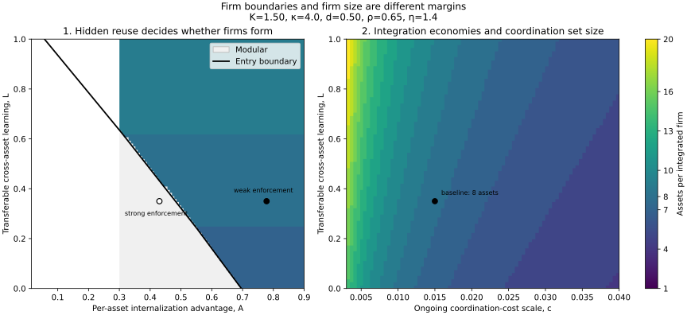

# Result II: from a reason to own to a theory of firm size

## Central claim

The hidden-reuse result explains an **extensive margin**: whether a valuable
context-generating asset is governed through a market contract or ownership.
It does not, by itself, explain an **intensive margin**: how many such assets
belong in the same firm.

This extension supplies that missing margin. Its main result is a separation:

> When the private benefit of solving hidden reuse is additive across otherwise
> homogeneous assets, it determines whether integrated firms form but not their
> equilibrium size. Conditional size is determined by shared fixed costs,
> transferable learning across assets, and the costs of organizing them
> together. The additivity is load-bearing: the separation holds if and only
> if the per-asset advantage is size-independent.

Additivity is a substantive assumption for this mechanism, not a free
normalization. A firm that owns more context-generating assets could plausibly
dilute the per-asset advantage of solving hidden reuse — the marginal asset's
context overlaps with what the firm already controls. The package therefore
implements a size-dependent advantage and exhibits the failure of separation
under it (Section 3.1).

This is a proposed theoretical contribution, not a claim that no related
separation result exists elsewhere. The generic ingredients—transaction costs,
residual control, knowledge capital, and coalition formation—are established
literatures. The distinctive move here is to connect the bilateral
hidden-reuse mechanism to a free-formation size problem and show exactly which
part of a cybernetic-rollup thesis it can and cannot establish.

## 1. Environment

There is a large population of homogeneous **nodes**. A node is a
context-generating operating asset such as a warehouse, clinic, laboratory,
insurance workflow, or industrial site. Its modular payoff is normalized to
zero. This means all values below are incremental to the node's best
arm's-length AI arrangement, not that a modular node produces nothing.

A firm can own and govern \(n\in\{1,\ldots,N\}\) nodes. Its incremental private
surplus is

\[
V(n)
=nA-K
+nL\frac{n-1}{\kappa+n-1}
-cn^{1+\eta}.
\]

The primitives are:

- \(A\): the per-node private advantage of internalization over the best
  modular contract;
- \(K\ge0\): a fixed AI-system cost shared across the firm's nodes;
- \(L\ge0\): the ceiling on useful learning transferred to each node from the
  firm's other nodes;
- \(\kappa>0\): the scale over which cross-node learning saturates;
- \(c\ge0\): the scale of coordination, financing, bureaucracy, and liability
  costs; and
- \(\eta\ge1\): the convexity of that organizational burden.

The cross-node term is zero for a one-node firm, increases with \(n\), and
approaches \(L\) per node. It captures a bounded version of the Cybernetic
Rollup idea: experience at one owned operation can improve decisions elsewhere,
but the transferable lesson pool eventually saturates.

The organizational term is deliberately broad. It includes the cost of
integrating systems, supervising more heterogeneous operations, financing
acquisitions, carrying correlated liability, and losing local adaptation.

Surplus per node is

\[
g(n;A)=\frac{V(n)}{n}
=A-\frac Kn
+L\frac{n-1}{\kappa+n-1}
-cn^\eta.
\]

Write

\[
h(n)=-\frac Kn
+L\frac{n-1}{\kappa+n-1}
-cn^\eta,
\]

so that \(g(n;A)=A+h(n)\).

The additive form is an assumption, not an implication of the bilateral
model. To keep that assumption inspectable rather than hard-coded, the
primitives include a dilution elasticity \(\zeta\ge0\)
(`advantage_dilution_elasticity`) under which the per-node advantage at size
\(n\) is \(An^{-\zeta}\), so that

\[
g(n;A,\zeta)=An^{-\zeta}+h(n).
\]

The default \(\zeta=0\) recovers the additive baseline exactly, and the text
below takes \(\zeta=0\) unless stated otherwise.

## 2. Equilibrium object

The baseline uses a homogeneous transferable-utility coalition game.
Potential firms form freely, nodes can be compensated for joining, and one
firm's value depends only on its own size. A **replica equilibrium** partitions
a population divisible by the selected size into equal-sized firms. Every node
inside those firms receives the equilibrium surplus per node.

This is stronger than calling a simulated ownership pattern “stable.” A
partition is supported only if no alternative coalition can create enough
value to make each of its members better off.

The divisibility condition keeps the theorem exact. The solver reports the
target size for a large population and a maximum feasible size \(N\). A finite
industry whose population is not divisible by the target needs an additional
remainder-allocation rule; the package does not relabel that planner problem as
an equilibrium.

## 3. Proposition: the boundary–size separation is a characterization

Write the per-node surplus in the general form \(g(n;A)=Ad(n)+h(n)\) with
\(d(n)>0\). The baseline is \(d\equiv1\); the dilution parameterization is
\(d(n)=n^{-\zeta}\). Define the conditional target set

\[
\mathcal N^*(A)
=\arg\max_{n\in\{1,\ldots,N\}}\bigl[Ad(n)+h(n)\bigr]
\]

and, for the additive case \(d\equiv1\), the integration threshold

\[
A^*=-\max_{n\in\{1,\ldots,N\}}h(n).
\]

Then:

1. if \(d\equiv1\) and \(A\le A^*\), no integrated coalition creates strictly
   positive incremental surplus, so modular governance is an equilibrium;
2. if \(d\equiv1\) and \(A>A^*\), integrated firms form at any size in
   \(\mathcal N^*\), provided that size divides the replica population;
3. every such equal-sized partition is immune to a blocking coalition under
   transferable utility;
4. if \(d\equiv1\), then \(A\) does not enter \(\mathcal N^*\). It changes
   integration entry but not conditional firm size; and
5. conversely, \(\mathcal N^*(A)\) is invariant to \(A\) for **every** choice
   of the scale primitives \(h\) if and only if \(d\) is constant. Whenever
   \(d(n_1)\ne d(n_2)\) for two feasible sizes, there exist scale primitives
   and advantage values at which raising \(A\) changes the conditional
   target, so the entry and size margins interact.

The separation is therefore a characterization of size-independent wedges,
not a general property of the model. It is exactly as credible as the
assumption that owning more assets leaves the per-asset advantage unchanged.

### Proof

For every candidate size,

\[
g(n;A)=A+h(n).
\]

Adding the same \(A\) to every size leaves their ranking unchanged, which gives
claim 4. If \(A\le A^*\), then

\[
g(n;A)\le A+\max_m h(m)\le0
\]

for every \(n\). No coalition can offer all its members a strictly positive
increment over the modular payoff of zero, proving claim 1.

If \(A>A^*\), any \(n^*\in\mathcal N^*\) produces positive surplus per node.
Partition a replica population into firms of size \(n^*\) and pay every member
\(g(n^*;A)\). A deviating coalition of size \(m\) has total value

\[
V(m)=m g(m;A)\le m g(n^*;A).
\]

It therefore cannot give every member more than the equilibrium payoff. No
coalition blocks, proving claims 2 and 3.

For claim 5, sufficiency of a constant \(d\) is claim 4. For necessity,
suppose \(d(n_1)>d(n_2)\). The pairwise comparison

\[
g(n_1;A)-g(n_2;A)
=A\bigl[d(n_1)-d(n_2)\bigr]+h(n_1)-h(n_2)
\]

is strictly increasing in \(A\). Choosing scale primitives with
\(h(n_2)-h(n_1)\) strictly between the values this expression takes at two
admissible advantage levels makes the comparison change sign between them, so
the argmax cannot contain the same size at both levels. ∎

When integer sizes tie, the solver reports all co-maximizers and selects the
smallest one as a transparent concentration-minimizing convention. The theorem
does not imply that the smaller tied size is uniquely selected.

### 3.1 A worked non-additive example

Set \(\zeta=0.5\) and keep every scale primitive at the anchor values of
Section 6 (\(K=1.50\), \(L=0.35\), \(\kappa=4\), \(c=0.05\), \(\eta=1.4\),
\(N=60\)). Per-node surplus is \(g(n)=An^{-1/2}+h(n)\), and entry now occurs
if and only if \(A\) exceeds the generalized threshold

\[
A^*(\zeta)
=\min_{n}\bigl[-h(n)\,n^{\zeta}\bigr]
=1.0671,
\]

which the solver reports in place of the additive threshold. The table shows
computed per-node surplus at small sizes for three advantage levels
(`solve_firm_size.py --advantage-dilution 0.5`):

| \(A\) | \(g(1)\) | \(g(2)\) | \(g(3)\) | \(g(4)\) | \(n^*\) at \(\zeta=0.5\) | \(n^*\) at \(\zeta=0\) |
|---:|---:|---:|---:|---:|---:|---:|
| 1.20 | \(-0.3500\) | \(+0.0366\) | \(+0.0767\) | \(+0.0268\) | 3 | 4 |
| 2.00 | \(+0.4500\) | \(+0.6023\) | \(+0.5386\) | \(+0.4268\) | 2 | 4 |
| 3.00 | \(+1.4500\) | \(+1.3094\) | \(+1.1159\) | \(+0.9268\) | 1 | 4 |

Under additivity the same three advantage levels all select four-node firms.
With dilution, raising \(A\) from 1.20 to 2.00 moves the conditional argmax
from three nodes to two, and at 3.00 the equilibrium is standalone
integration: the advantage is worth most per asset at small scale, so a
larger wedge buys entry and *shrinks* the conditional firm at the same time.
Any shock that operates through \(A\) — enforcement, verifiability,
pledgeability — then moves both margins, which is precisely what the additive
baseline rules out.

Two solver caveats accompany \(\zeta>0\). The advantage term \(An^{-\zeta}\)
is convex in continuous size, so per-node surplus need not be single-peaked;
the package restricts the continuous benchmark to \(\zeta=0\) and reports the
discrete optimum, which is found by exhaustive evaluation and needs no
concavity. And the threshold \(A^*(\zeta)\) no longer pins down the entry
size independently of \(A\): the size at which integration first appears is
itself part of the joint solution.

## 4. Continuous characterization and comparative statics

This section takes \(\zeta=0\). With \(\zeta>0\) the first-order condition
gains the term \(-\zeta An^{-\zeta-1}\) — implemented in
`per_node_surplus_derivative` — but the concavity argument below fails
because \(An^{-\zeta}\) is convex, so the package restricts the continuous
benchmark to \(\zeta=0\) and raises an error otherwise.

Treating \(n\) as continuous, an interior target satisfies

\[
\frac{\partial g}{\partial n}
=\frac K{n^2}
+\frac{L\kappa}{(\kappa+n-1)^2}
-c\eta n^{\eta-1}
=0.
\]

The first two terms are the marginal advantages of spreading the fixed cost
and transferring another unit of learning. The final term is the marginal
organizational burden.

For \(\eta\ge1\),

\[
\frac{\partial^2 g}{\partial n^2}
=-\frac{2K}{n^3}
-\frac{2L\kappa}{(\kappa+n-1)^3}
-c\eta(\eta-1)n^{\eta-2}
\le0.
\]

Except for degenerate flat cases, per-node surplus is single-peaked. The
continuous optimum is unique, and the integer optimum lies on an adjacent
integer.

The model implies:

- a larger \(A\) raises surplus at every size one-for-one but leaves the target
  size unchanged (at \(\zeta=0\); with dilution it also shrinks the target, as
  in Section 3.1);
- a larger shared fixed cost \(K\) weakly raises conditional size because its
  per-node burden falls faster in larger firms;
- more transferable learning \(L\) weakly raises conditional size;
- a larger organizational-cost scale \(c\) weakly reduces conditional size;
- slower learning realization (larger \(\kappa\)) raises the integration
  threshold, although its effect on the selected size can be ambiguous; and
- if the target is \(N\) and the derivative remains positive there, the
  industry bound is binding. The model has not found an interior firm size and
  must not call that outcome a finite optimum.

The entry threshold moves differently:

- stronger fixed and organizational costs raise \(A^*\);
- more transferable learning lowers \(A^*\); and
- better enforcement or capability pledgeability can lower the bilateral
  value fed into \(A\), moving the market back below the threshold.

Because \(n^*\) need not equal one, crossing \(A^*\) can create a discrete jump
from modular trade to multi-asset firms. A rollup can appear suddenly without
the optimal firm growing gradually from one node.

## 5. Mapping the bilateral model into \(A\)

The code supplies a transparent bridge rather than hiding the connection in a
calibration residual.

1. Remove immediate ownership from the context owner's bilateral option set.
2. Solve for its best remaining outcome: secure contracting, priced reuse,
   withholding, multi-provider use, or exit.
3. Compute the value of full internal operation before scale-specific costs.
4. Define the difference as the owner's per-node internalization advantage.

Formally, the bridge reports

\[
A
=\underbrace{B(1)+\delta I_2}_{\text{gross full internal use}}
-\underbrace{U_O^{\text{best modular}}}_{\text{owner's modular payoff}}.
\]

This is a **private** willingness to pay for control. It includes rent capture
as well as productive efficiency and is not a social-surplus statistic. That
distinction is essential: a rollup can be privately profitable even when part
of its return is a transfer from a provider or seller.

## 6. Computed anchor case

The displayed normalization uses

\[
K=1.50,\quad L=0.35,\quad \kappa=4,
\quad c=0.05,\quad \eta=1.4,\quad N=60.
\]

The conditional discrete target is four nodes, the continuous target is
\(4.007\), and the entry threshold is

\[
A^*=0.5732.
\]

The bilateral bridge produces:

| Bilateral environment | Derived \(A\) | Scale outcome |
|---|---:|---|
| Strong enforcement, no hidden reuse | 0.4300 | Modular market |
| Weak enforcement, unpriced reuse | 0.7780 | Four-node rollups |
| Weak enforcement, 60% verifiable value | 0.6565 | Four-node rollups |

These are calibrated theoretical comparisons, not measured magnitudes. Their
purpose is to demonstrate the separation: enforcement and pledgeability move
the market across the ownership boundary while the scale primitives hold the
conditional target at four.

### 6.1 The four-node anchor is a normalization

The scale primitives deserve a blunter statement than "displayed
normalization." \(K\), \(c\), and \(\eta\) are free parameters of this
extension. Nothing connects them to the bilateral integration cost
\(F=0.70\) in MODEL.md or to any measured organizational cost; they were
chosen so that the conditional target lands on a small, readable number. The
four-node rollup is therefore an anchor for exposition, not a prediction
about acquisition counts, and only the comparative statics of Section 4 carry
across parameter choices.

The table reports the conditional target \(n^*\) over a modest grid around
the anchor, holding the other primitives fixed (\(\zeta=0\), so \(n^*\) is
independent of \(A\); the anchor cell is bold):

| \(\eta\) | \(K\) | \(c=0.025\) | \(c=0.050\) | \(c=0.100\) |
|---:|---:|---:|---:|---:|
| 1.2 | 0.75 | 6 | 4 | 3 |
| 1.2 | 1.50 | 7 | 5 | 4 |
| 1.2 | 3.00 | 9 | 6 | 5 |
| 1.4 | 0.75 | 4 | 3 | 2 |
| 1.4 | 1.50 | 6 | **4** | 3 |
| 1.4 | 3.00 | 7 | 5 | 4 |
| 1.7 | 0.75 | 3 | 3 | 2 |
| 1.7 | 1.50 | 4 | 3 | 2 |
| 1.7 | 3.00 | 5 | 4 | 3 |

Halving or doubling \(K\) and \(c\) and shifting \(\eta\) by a few tenths
moves the target anywhere from two to nine nodes, always in the directions
the comparative statics predict: up in \(K\), down in \(c\) and \(\eta\). The
robust content is those monotone forces and the entry-threshold logic, not
the number four.



The left panel varies \(A\) and \(L\). Gray cells remain modular; colored cells
form integrated firms, with color denoting assets per firm. For a given row,
moving \(A\) crosses the black entry boundary but does not change the color.
The right panel removes the entry decision and shows how learning and
organizational cost change conditional size.

## 7. What the result adds to the prior essays

The essays argue that context remains local and that capital may acquire the
assets which continually regenerate it. The bilateral result identifies one
reason: information cannot always be used, controlled, or priced without
changing future bargaining power.

This extension makes the rollup prediction conditional:

- hidden reuse can explain **why ownership begins**;
- shared systems and cross-node learning explain **why ownership extends across
  multiple assets**; and
- coordination, finance, and liability explain **where it stops**.

The negative result matters as much as the positive one. If learning at one
site does not improve decisions elsewhere and shared fixed costs are small,
Arrowian leakage can produce many separately integrated firms rather than a
large rollup. A theory of ownership is not automatically a theory of
concentration.

## 8. Empirical implications and falsifiers

The model suggests testing different margins separately.

1. **Boundary shocks.** Better non-retention enforcement, verifiability, or
   collateral should reduce integration incidence. Conditional firm size need
   not change if these shocks only alter additive \(A\).
2. **Transfer tests.** Acquirers should become larger where an operational
   improvement learned at one node transfers strongly to other owned nodes.
3. **Organization tests.** Liability, local regulation, financing friction,
   and integration complexity should reduce acquired-node counts even when
   hidden-reuse concerns remain severe.
4. **Parallel-shift test.** In estimated per-node value curves, a pure change in
   the hidden-reuse wedge should shift all candidate sizes vertically. If it
   changes the slope, then the wedge itself has scale economies and the
   baseline separation fails.
5. **Stopping rule.** The next acquisition should cease to be attractive when
   its fixed-cost and learning contribution no longer offsets its marginal
   organizational burden and purchase cost.

A clean empirical rejection would be a setting in which enforcement changes
conditional firm size substantially even after controlling for shared costs
and cross-node transferability. That would indicate \(A=A(n)\), not the
additive advantage assumed here. The dilution mode of Section 3.1 makes that
alternative computable rather than merely hypothetical: under it the model
predicts exactly the joint movement of entry and size that would falsify the
baseline.

## 9. Limitations and next extensions

The baseline intentionally excludes:

- heterogeneous nodes and a network-valued learning matrix \(L_{ij}\);
- endogenous acquisition prices, capital constraints, and seller bargaining;
- competition among several potential acquirers;
- knowledge spillovers across firm boundaries;
- dynamic learning, entry, exit, and merger timing;
- managerial incentive and delegation problems; and
- antitrust or social-welfare analysis.

Version 0.4 supplies a tractable intermediate model. It replaces homogeneous
\(L\) with a directed matrix \(\Gamma=(\gamma_{ij})\), lets one intermediary
acquire any subset \(S\), and compares common ownership with learning through
independent customer access. The exact subset solution explains composition as
well as size and is documented in
[OWNERSHIP-ACCESS-RESULT.md](OWNERSHIP-ACCESS-RESULT.md).

That extension remains short of the general partition problem anticipated
here. Competing acquirers, spinouts, and coalitional blocking would require
payoff allocation across several endogenous firms. Keeping that distinction
explicit prevents a single-intermediary optimum from being mislabeled as
stack-wide concentration equilibrium.

## 10. Reproduction

The analytical source is
[`src/hidden_reuse/firm_size.py`](src/hidden_reuse/firm_size.py). Run:

```bash
python3 scripts/solve_firm_size.py
python3 scripts/solve_firm_size.py \
  --derive-advantage-from-hidden-reuse \
  --enforcement 0.20
python3 scripts/solve_firm_size.py \
  --internalization-advantage 1.20 \
  --advantage-dilution 0.5
python3 scripts/generate_firm_size.py
python3 -m pytest tests/test_firm_size.py
```

The generator writes the figure in SVG and PNG, both underlying grids as CSV,
worked bridge examples as JSON, and a run summary containing the complete
normalization and software versions.
